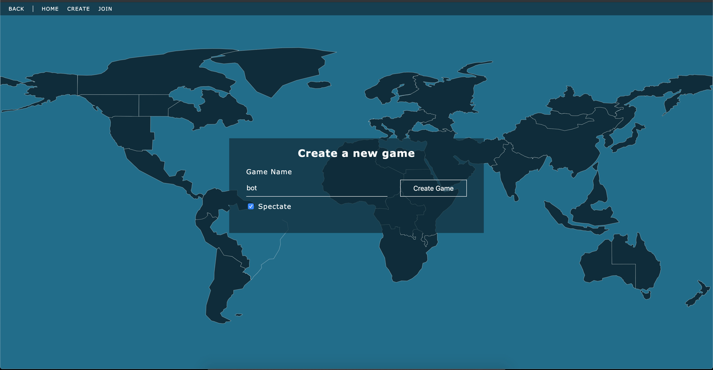

# Map Conquest

This is a proof of concept building a board-like game like risk using sockets, node-js and vue
Its been a learning and experimentation project for me for the last bit.

Experimenting with inheritance, classes etc

If you want to see a quick example of bots playing the game i uploaded a short video of it on [youtube](https://youtu.be/j9564NkKGi0).

Issues and contributions are welcome. As I mentioned earlier this project is a way for me to continue learning & building.



## Node version

Built on `node v12.13.1` && `npm 6.12.1`, you may find some binding incompatibilities with earlier versions of node.
For switching versions on your system I would recommend `nvm` or the npm package `n`.

## ENV

Everything works fine without having an .env file but for tweaking settings or variables create an `.env` file in the root
`.env` is ignored, see the sample file [./.env.sample](./.env.sample)

## Commands

1. Start dev server

```
npm run dev
```

2. Build Frontend

```
npm run watch
```

3. Run a bot instance

```
npm run bot:dev
// or
npm run bot-challenger:dev
```